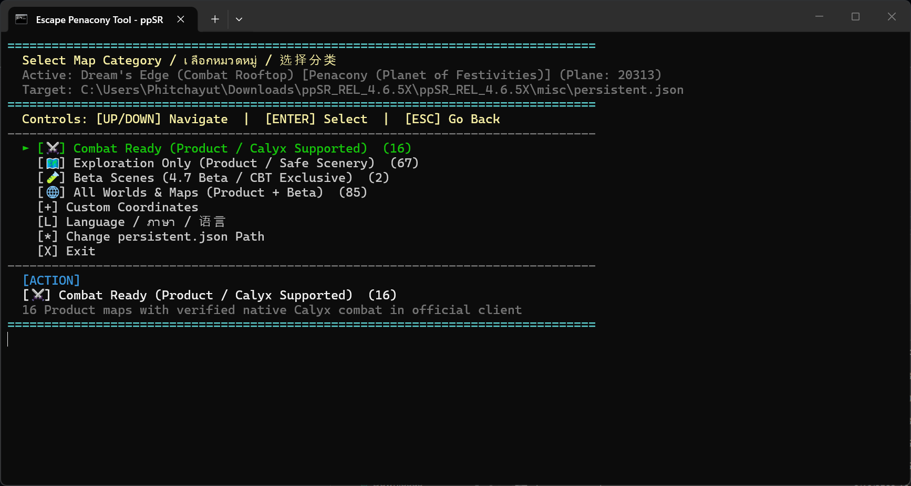

<div align="center">

# Escape Penacony Tool (ppSR 场景传送与地图管理工具)

*专为 ppSR 打造的交互式全场景传送与地图管理工具。*

[English](../README.md) · [简体中文](README_ZH.md)

</div>

---

一个专为 **ppSR** 打造的交互式、零硬编码 CLI 传送与地图管理工具。  
帮助玩家轻松摆脱匹诺康尼的束缚，自由探索全游戏各个世界的场景与副本，并提供完整的拟造花萼战斗支持！

<div align="center">



</div>

---

## ✨ 功能特性

- **🌐 三语本地化支持 (EN / TH / ZH)**：
  - English (EN)
  - ภาษาไทย (TH)
  - 简体中文 (ZH)
  - 可在终端菜单中通过 **`[L]`** 选项或编辑 `ppsr_config.json` 随时无缝切换语言。
- **🎯 100% 真实传送坐标 (Ground-Truth)**：
  - 所有出生点与传送坐标均直接提取自官方 `res.json` 与 `scene_config` 传送锚点，彻底解决人物悬空卡死问题。
- **🗺️ 完整翁法罗斯 (Amphoreus) 与解谜地图支持**：
  - **全世矩阵 / 斯提克斯 (Plane 20461)**：龙骨矩阵遗迹与奇美拉中枢。
  - **哀丽秘榭 / 苍穹神域 (Plane 20431)**：日影天象与 CPU 病毒核心解谜。
  - **塔耳塔洛斯深渊与魂河 (Plane 20432)**：浮石平台与罗盘解谜。
  - **冥河外港 (Plane 20433)**：水门港湾与时光锁机关。
  - **悬锋城 / 命运重渊 (Plane 20412 & 20413)**：预言之殿（黎明 / 永夜状态）与地下墓道昼夜雕像对齐解谜。
  - **雅努萨波利斯 & 神悟树庭 (Plane 20421, 20422, 20423)**：半神议院、辉痕圣林与葬忆彼岸（Era Flipper 光线折射解谜）。
  - **缪斯神殿 (Plane 20451)**：雪域神庙与控制台纪元切换。
  - **龙之古墓 (Plane 20462)**：幽冥地宫与升降梯符文激活。
  - **阿瑞斯天空竞技场 (Plane 20481 & 20482)**：羽之神祠与战舰空港停机坪。
- **⚔️ 花萼战斗模式与分类筛选**：
  - 选择世界前支持前置分类筛选：**[⚔️] 战斗就绪 (支持花萼)** vs **[🗺️] 仅限探索 (安全模式)** vs **[🌐] 全部地图**。
  - 在探索模式下，花萼被安全置于地底（`Y = -999999`），杜绝误触与无限加载卡死。
  - 在战斗模式下，精准绑定官方花萼属性（Group ID & Inst ID），流畅触发战斗。
- **🚀 一键重启 ppSR 服务端**：
  - 支持直接在菜单中一键重启 `ppsr.exe`，自动开启专用 UTF-8 窗口（`chcp 65001`），杜绝中文乱码。

---

## 🎮 使用方法

1. 双击运行 **`change_scene.bat`**。
2. 按 **`[L]`** 选择语言（English / ภาษาไทย / 简体中文）。
3. 选择传送模式：**[⚔️] 战斗就绪**、**[🗺️] 仅限探索** 或 **[🌐] 全部地图**。
4. 使用 **`[↑]`** / **`[↓]`** 方向键高亮选择目标**世界 / 星球**。
5. 按 **`[ENTER]`** 查看该世界下的场景列表。
6. 选择目标**场景 / 地图**并按 **`[ENTER]`**。
7. 工具将自动更新 `persistent.json` 并备份旧配置 (`persistent.json.bak`)。
8. 直接在菜单中选择 **`[2] 重启并启动 ppSR 服务端`**。
9. 登录游戏即可开始探索！

---

## 📁 项目结构

```text
Escape-penacony/
├── change_scene.bat       # 快速启动批处理脚本 (自动设置 120x32 窗口)
├── ppsr_teleport.ps1      # 交互式传送核心引擎 (EN/TH/ZH)
├── scenes.json            # 8 大世界 85 个地图的本地化数据库
├── start_ppsr.bat         # ppsr.exe 的 UTF-8 启动脚本
├── Android Termux/        # Android / Termux 移动端 CLI 版本 (Python 3)
│   ├── teleport.py        # 移动端命令行传送工具
│   ├── scenes.json        # 内置场景数据库
│   ├── start.sh           # Termux 一键启动脚本
│   └── README.md          # Termux 使用说明文档
├── Android APK/           # Android APK 独立应用项目 (占位与规划中)
│   └── README.md          # APK 规划与说明文档
├── README.md              # 英文主说明文档
├── docs/
│   └── README_ZH.md       # 简体中文说明文档
└── .gitignore             # 忽略配置文件与临时文件
```

---

## ⚠️ 注意事项

- ppSR 仅在启动时读取一次 `persistent.json`。若服务端已在运行，请通过选项 `[2]` 或 `start_ppsr.bat` 重启生效。

---

## 💖 致谢与鸣谢 (Credits & Acknowledgements)

- 特别感谢 **Oriyuki** 提供完整的中文地图场景名称翻译与定位校对！
